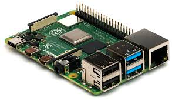
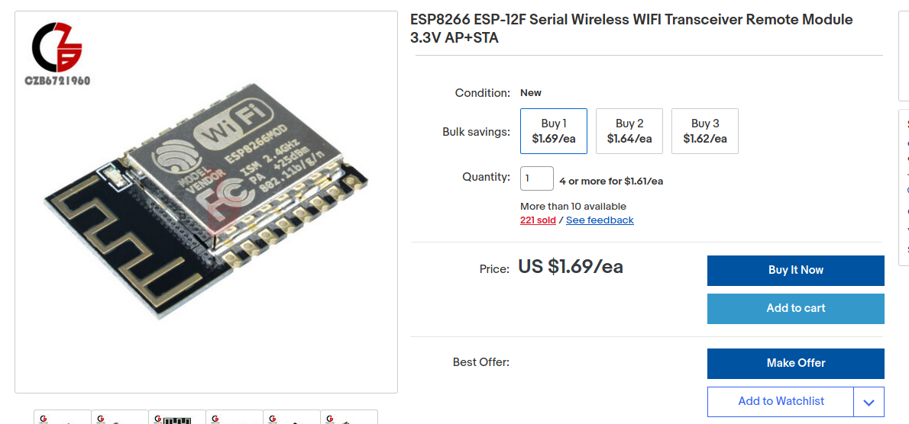

---

# Technology + Low Cost = IoT Explosion

|    **Cloud**     | **Compute @ Edge** |
| :--------------: | :----------------: |
| **Connectivity** |    **Devices**     |
| **Open Source**  |                    |

---

# Cloud

|       |  |
| ---------------- | --------------- |
|    |    |
|      |   |
|  |                 |

---

# Compute resources at edge

|     |      |
| --------------- | -------------------- |
|  |  |

---

# Connectivty

| **CAT-M**          |  |
| ------------------ | ---------------- |
|  | **NB-IOT**       |

---

# **Connected devices**

****

****

****

---

# OSS

|        |      |
| :---------------: | :--------------: |
|     |     |
|    |     |
|  |  |
|      |                  |

---

# Applications for IoT

_Interesting solutions are the ones where the cost savings quickly pays for the
solution._

|      **HVAC**      | **Machine Monitoring** |
| :----------------: | :--------------------: |
| **Infrastructure** |    **Agriculture**     |

**Areas of cost savings:**

1. Improved efficiency
2. Time saving
3. Reduce damage/waste
4. Preventive maintenance

---

# IoT Systems are Distributed and Realtime Systems


---

# 1st pass at sending data from devices

```go
type SystemState struct {
    MemUsed int
    CpuTemp float32
    DiskUsed int
}

type IO123 {
    AnalogInputs []float32
    DigitalInputs []bool
    RelayState []bool
}
```

---

# Better way to send data from device

```go
type Sample struct {
        // ID of the sensor that provided the point
        ID string

        // Type of point (voltage, current, key, etc)
        Type string

        // Index is used to specify a position in an array such as
        // which pump, temp sensor, etc.
        Index int

        // Time the point was taken
        Time time.Time

        // Duration over which the point was taken. This is useful
        // for averaged values to know what time period the value applies
        // to.
        Duration time.Duration

        // Average OR
        // Instantaneous analog or digital value of the point.
        // 0 and 1 are used to represent digital values
        Value float64

        // Optional text value of the point for data that is best represented
        // as a string rather than a number.
        Text string

        // statistical values that may be calculated over the duration of the point
        Min float64
        Max float64
}
```

---

# 1st pass at device config

```go
type Device struct {
	ID            string
	Config        DeviceConfig
	State         DeviceState
	CmdPending    bool
	SwUpdateState SwUpdateState
	Groups        []uuid.UUID
	Rules         []uuid.UUID
}

// DeviceState represents information about a device that is
// collected, vs set by user.
type DeviceState struct {
	Version  DeviceVersion
	Ios      []Sample
	LastComm time.Time
	SysState SysState
}

```

---

# A simpler way to represent device config/state

```go
type Node struct {
        ID     string
        Type   string
        Points Points
}
```

---

# Node Tree


---

# Easy to customize


